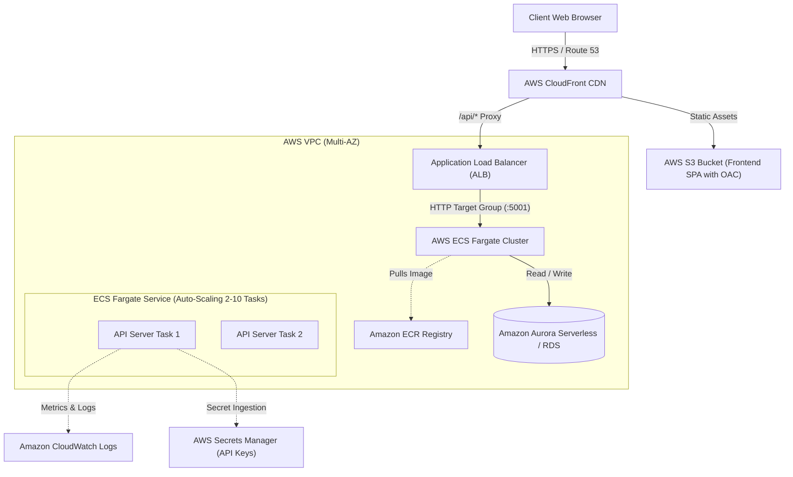

# 🧪 Esperia Studio — Enterprise AI Test Case Generator

[](https://github.com/cmoo7/ai-testcase-generator/actions)
[](https://www.typescriptlang.org/)
[](https://react.dev/)
[](https://nodejs.org/)
[](https://www.docker.com/)
[](LICENSE)

An enterprise-grade, full-stack web application designed for Software Engineers, Product Managers, and QA Automation Architects to automatically ingest software requirements, user stories, or PRDs and synthesize comprehensive, multi-dimensional test suites.

Built with **React (Vite + TypeScript + Tailwind CSS)** on the frontend, a **Layered Node.js/Express (TypeScript + Prisma)** backend, and an **Intelligent QA Synthesis Engine** that enforces strict JSON schemas and validates test completeness.

---

## 📑 Table of Contents

- [Key Differentiators & Highlights](#-key-differentiators--highlights)
- [System Architecture & Data Flow](#-system-architecture--data-flow)
- [Architectural Decision Records (ADRs)](#-architectural-decision-records-adrs)
- [Tech Stack Overview](#-tech-stack-overview)
- [Quick Start Guide](#-quick-start-guide)
  - [Prerequisites](#prerequisites)
  - [Option A: Local Development (Fastest)](#option-a-local-development-fastest)
  - [Option B: One-Command Docker Compose](#option-b-one-command-docker-compose)
- [Database Schema & Prisma Model](#-database-schema--prisma-model)
- [API Reference](#-api-reference)
- [DevOps & CI/CD Pipeline](#-devops--cicd-pipeline)
- [Enterprise Cloud & AWS Production Architecture](#️-enterprise-aws-production-architecture)
- [Video Walkthrough & Feature Flow](#-video-walkthrough--feature-flow)

---

## 🌟 Key Differentiators & Highlights

1. **AI Requirement Linter & Ambiguity Scorer**:
   - Before outputting test cases, the system analyzes the user story for vagueness, unstated assumptions, and security gaps, outputting a **Completeness Score (0-100%)**, **Clarity Score**, and actionable recommendations.
2. **Dual-Mode View: Manual QA vs. Automated BDD/Gherkin**:
   - Seamlessly toggle between **Manual QA Spec** (Preconditions, numbered steps, expected results) and **Cucumber BDD** (`Feature`, `Scenario`, `Given-When-Then`) with one-click copy.
3. **Multi-Dimensional Test Coverage**:
   - Covers **Positive (Happy Path)**, **Negative (Failure Modes)**, **Edge & Concurrency (Boundary Values, Race Conditions)**, **Validation (Schema Constraints)**, and **Security (OWASP Vectors & Privilege Escalation)**.
4. **Targeted AI Refinement Dialog**:
   - Re-prompt the AI with granular instructions (e.g., *"Add more boundary tests for negative currency balances"* or *"Focus on token expiration edge cases"*).
5. **Multi-Format Enterprise Export**:
   - Instantly preview and export test suites as **Markdown Specification (`.md`)**, **Cucumber BDD (`.feature`)**, **Jira / Xray (`.csv`)**, or **JSON (`.json`)**.
6. **Zero-Trust Client Key Management (BYOK)**:
   - Optional Bring-Your-Own-Key modal stores user keys strictly in browser `localStorage` and transmits via request headers without persisting on the server.
7. **Zero-Friction Fallback Engine**:
   - Built-in resilient heuristic synthesis engine ensures full end-to-end functionality immediately upon cloning, even without external cloud API keys.

---

## 🏗 System Architecture & Data Flow

```
┌─────────────────────────────────────────────────────────────────────────────┐
│                              React Frontend SPA                              │
│   (Vite + TypeScript + Tailwind CSS + Lucide Icons + LocalStorage BYOK)     │
└──────────────────────────────────────┬──────────────────────────────────────┘
                                       │ HTTPS / JSON (X-Request-ID Header)
┌──────────────────────────────────────▼──────────────────────────────────────┐
│                    Layered Node.js / Express API Server                     │
│  ┌───────────────────────────────────────────────────────────────────────┐  │
│  │ Middlewares: Helmet, Strict CORS, Express Rate Limit, RFC 7807 Errors │  │
│  └───────────────────────────────────┬───────────────────────────────────┘  │
│                                      │                                       │
│  ┌───────────────────────────────────▼───────────────────────────────────┐  │
│  │ Controllers & DTO Validation (Zod Schema Validation)                  │  │
│  └───────────────────────────────────┬───────────────────────────────────┘  │
│                                      │                                       │
│  ┌───────────────────────────────────▼───────────────────────────────────┐  │
│  │ TestSuiteService (Business Logic, Orchestration, Gherkin Serializer)  │  │
│  └───────────────┬───────────────────────────────────────┬───────────────┘  │
└──────────────────┼───────────────────────────────────────┼──────────────────┘
                   │ Prisma ORM                            │ Structured JSON
┌──────────────────▼───────────────────┐   ┌───────────────▼──────────────────┐
│      SQLite / PostgreSQL Database    │   │         AI QA Engine             │
│   - test_suites (Metadata, Scores)   │   │   - Cloud LLM / OpenAI API       │
│   - test_cases (Steps, Assertions)   │   │   - Resilient Fallback Engine    │
└──────────────────────────────────────┘   └──────────────────────────────────┘
```

---

## 🧠 Architectural Decision Records (ADRs)

### ADR-01: Layered Backend Architecture (Separation of Concerns)
- **Context**: Monolithic single-file Express servers create tight coupling and make automated testing brittle.
- **Decision**: Implemented strict layered architecture:
  - `controllers/`: Handles HTTP parameters, parses headers, and invokes services.
  - `services/`: Encapsulates business logic, DTO mapping, and AI engine calls.
  - `repositories/`: Encapsulates Prisma database queries.
  - `schemas/`: Single source of truth using **Zod** for runtime validation.
- **Consequence**: Decoupled components allow 100% mocked unit testing and zero-impact database or provider swapping.

### ADR-02: Defensive AI Engineering (JSON Schema Enforcement & Fallback)
- **Context**: LLMs are nondeterministic and can return malformed JSON, markdown artifacts, or hallucinate outside QA bounds.
- **Decision**: Prompts demand strict JSON adhering to a defined schema. Responses pass through a sanitizer stripping markdown tags, followed by runtime verification against `TestCaseSchema` and `RequirementQualitySchema`. An intelligent heuristic engine serves as an automatic fallback if external cloud quotas are exceeded or keys are omitted.
- **Consequence**: Guaranteed schema compliance, zero runtime JSON crashes, and immediate usability.

### ADR-03: Zero-Friction Persistence (Prisma + SQLite with Postgres Parity)
- **Context**: Requiring an external database daemon like MongoDB or PostgreSQL creates onboarding friction.
- **Decision**: Used Prisma ORM configured with SQLite (`file:./dev.db`) for local runs and Docker, while maintaining 100% schema parity for immediate migration to PostgreSQL in production environments.
- **Consequence**: Reviewers and developers can clone and run `npm run dev` in under 30 seconds without spinning up local database daemons.

### ADR-04: Security & Zero-Trust
- **Context**: Storing user LLM API keys in backend databases creates compliance and security liabilities.
- **Decision**: Implemented dual-key support. Server-level keys are loaded via secure environment variables. Client-level custom keys (BYOK) reside strictly in the user's browser `localStorage` and are passed per request via `x-api-key`.
- **Consequence**: Zero secret exposure and complete privacy for the user.

---

## 🛠 Tech Stack Overview

- **Frontend**: React 18, TypeScript, Vite, Tailwind CSS, Lucide React
- **Backend**: Node.js 22, Express 4/5, TypeScript, Prisma ORM, Zod, Helmet, Express-Rate-Limit, UUID
- **Database**: SQLite (local zero-dependency) / PostgreSQL (production)
- **Testing**: Vitest, Supertest (100% passing automated test suite)
- **DevOps**: Docker (multi-stage alpine), Docker Compose, Nginx, GitHub Actions CI, Kubernetes Helm, Terraform

---

## 🚀 Quick Start Guide

### Prerequisites
- **Node.js**: v18+ (v20 or v22 recommended)
- **npm**: v9+
- Optional: **Docker & Docker Compose**

---

### Option A: Local Development (Fastest)

1. **Clone the repository:**
   ```bash
   git clone https://github.com/cmoo7/ai-testcase-generator.git
   cd ai-testcase-generator
   ```

2. **Install all dependencies:**
   ```bash
   npm install --workspace=server
   npm install --workspace=client
   npm install
   ```

3. **Initialize the local database:**
   ```bash
   cd server
   npx prisma generate
   npx prisma db push
   cd ..
   ```

4. **(Optional) Configure AI API Keys:**
   Copy `.env.example` in `server/` to `server/.env`:
   ```bash
   cp server/.env.example server/.env
   ```
   Add your `LLM_API_KEY` or `OPENAI_API_KEY`.
   *(Note: If left blank, the app will run with the built-in intelligent heuristic QA engine!)*

5. **Run the Full Stack with a single command:**
   ```bash
   npm run dev
   ```
   - **Frontend App**: [http://localhost:5173](http://localhost:5173)
   - **Backend API**: [http://localhost:5001](http://localhost:5001)
   - **Healthcheck**: [http://localhost:5001/api/healthz](http://localhost:5001/api/healthz)
   - **DB Readiness Probe**: [http://localhost:5001/api/readyz](http://localhost:5001/api/readyz)

6. **Run Automated Test Suite:**
   ```bash
   npm run test
   ```

---

### Option B: One-Command Docker Compose

Run the entire containerized architecture (Frontend Nginx + Backend API + Volume persistence):

```bash
docker compose up --build -d
```

- **Web Application**: [http://localhost:3000](http://localhost:3000)
- **Backend API**: [http://localhost:5001](http://localhost:5001)

To view logs:
```bash
docker compose logs -f
```

To stop containers:
```bash
docker compose down
```

---

## 🗄 Database Schema & Prisma Model

```prisma
model TestSuite {
  id              String     @id @default(uuid())
  title           String
  rawRequirement  String
  modelUsed       String     @default("gpt-4o-mini")
  qualityScore    Int?       @default(85)
  qualityFeedback String?
  createdAt       DateTime   @default(now())
  updatedAt       DateTime   @updatedAt
  testCases       TestCase[]

  @@map("test_suites")
}

model TestCase {
  id             String    @id @default(uuid())
  suiteId        String
  suite          TestSuite @relation(fields: [suiteId], references: [id], onDelete: Cascade)
  testCaseId     String
  title          String
  description    String
  dimension      String    // POSITIVE, NEGATIVE, EDGE_CASE, VALIDATION, SECURITY
  priority       String    // HIGH, MEDIUM, LOW
  preconditions  String
  steps          String    // JSON serialized array of steps
  expectedResult String
  gherkin        String?
  status         String    @default("DRAFT") // DRAFT, REVIEWED, APPROVED
  createdAt      DateTime  @default(now())
  updatedAt      DateTime  @updatedAt

  @@index([suiteId])
  @@index([dimension])
  @@map("test_cases")
}
```

---

## 📡 API Reference

All responses follow the RFC 7807 standardized envelope:

### Test Suite Endpoints

| Method | Endpoint | Description | Request Body |
| :--- | :--- | :--- | :--- |
| `POST` | `/api/generate` | Synthesize test cases from requirement | `{ requirement, dimensions, userApiKey?, provider? }` |
| `POST` | `/api/refine` | Re-prompt / iterate on test suite with QA feedback | `{ requirement, previousTestCases, feedbackPrompt }` |
| `POST` | `/api/suites` | Save test suite to persistent database | `{ title, rawRequirement, modelUsed, testCases }` |
| `GET` | `/api/suites` | List all saved test suites with case counts | *None* |
| `GET` | `/api/suites/:id` | Get specific test suite by ID | *None* |
| `PUT` | `/api/suites/:id` | Update test suite title or test cases | `{ title?, testCases? }` |
| `DELETE`| `/api/suites/:id` | Delete test suite from database | *None* |

### System & Health Observability

| Method | Endpoint | Purpose | Output Sample |
| :--- | :--- | :--- | :--- |
| `GET` | `/api/healthz` | Kubernetes / Docker liveness probe | `{ status: "HEALTHY", uptimeSeconds: 120, memoryUsageMb: 42 }` |
| `GET` | `/api/readyz` | Database & AI engine connectivity check | `{ status: "READY", database: "CONNECTED", aiEngine: "ACTIVE" }` |

---

## 🔄 DevOps & CI/CD Pipeline

The repository includes a production-grade GitHub Actions workflow (`.github/workflows/ci.yml`) triggering on pushes and pull requests:

1. **Static Analysis & Linting**: `tsc --noEmit` verifies strict type-checking across frontend and backend.
2. **Automated Unit & Integration Testing**: Executes Vitest suite with Supertest against live API routes, checking Zod validation and DB persistence.
3. **Container Build Verification**: Multi-stage Docker builds run inside CI to guarantee that both `Dockerfile.server` and `Dockerfile.client` produce lean, operational images without regressions.
4. **CD & Packaging** (`.github/workflows/deploy.yml`): Automatically packages and publishes multi-arch container images to GitHub Container Registry (GHCR) and executes Helm deployment dry-runs.

---

## ☁️ Live Cloud Deployment Guide

### Deploying to Render (Blueprint Ready)
An Infrastructure-as-Code blueprint (`render.yaml`) is included in the root directory:
1. Push this repository to GitHub.
2. In Render, select **New +** -> **Blueprint**.
3. Point to this repository. Render automatically provisions:
   - Backend API Service (`PORT=5001`, Node 22, persistent storage)
   - Frontend Static SPA (Vite build with client-side routing rewrites)

---

## 🏛️ Enterprise AWS Production Architecture

For enterprise-scale cloud deployments, this repository includes production-ready **AWS Infrastructure as Code (Terraform)** in `infra/terraform/aws-production.tf` and **ECS Fargate Task Definitions** in `infra/aws/ecs-task-definition.json`.



### AWS Deployment Components Provided:
1. **Frontend Edge Hosting**: Amazon S3 bucket with **Origin Access Control (OAC)** fronted by Amazon CloudFront CDN with SSL termination and SPA fallback routes.
2. **Backend Container Orchestration**: **AWS ECS Fargate** with target-tracking auto-scaling policies (70% CPU / 75% Memory).
3. **Ingress & Load Balancing**: **Application Load Balancer (ALB)** with active healthcheck target groups monitoring `/api/healthz`.
4. **Security & Secrets**: AWS Secrets Manager dynamically injecting API keys into container environment variables without hardcoding.
5. **Observability**: CloudWatch Logs group (`/ecs/esperia-ai-testcase-generator`) with 30-day retention policy and Container Insights.
6. **Serverless Alternative**: AWS App Runner configuration in `infra/aws/app-runner.yaml` for zero-maintenance container execution.
7. **Kubernetes Alternative**: Production Helm chart in `infra/helm/testcase-generator` supporting autoscaling and ingress.

---

## 🎥 Video Walkthrough & Feature Flow

The recorded demonstration covers the following technical flow:
1. **System Health & Observability**: Real-time inspection of `/api/healthz` and `/api/readyz` showing DB connection and container uptime.
2. **Requirement Ingestion**: Ingesting user stories via templates or raw text, and toggling target testing dimensions (Positive, Negative, Edge, Validation, Security).
3. **AI Requirement Linter**: Evaluating requirement completeness and clarity scores, surfacing unstated assumptions and recommendations.
4. **Test Case Review & Dual-Mode Toggle**: Switching between the standard QA table and Cucumber BDD (`Given-When-Then`) format.
5. **Interactive Management**: Inline editing of steps and preconditions, adding custom scenarios, and targeted AI re-prompting.
6. **Persistence & Export**: Saving the test suite to the database, retrieving historical suites, and exporting to Markdown, Gherkin `.feature`, Jira CSV, and JSON.

---

## 📜 License
MIT License.
